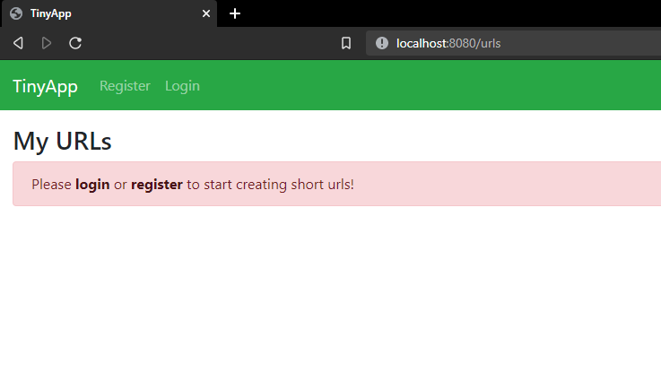
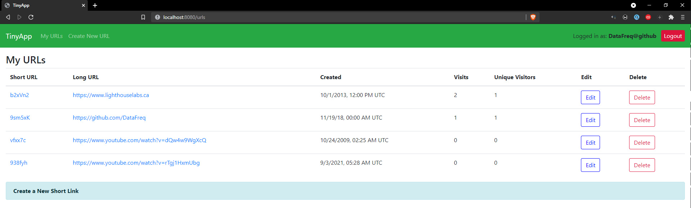

# TinyApp Project

TinyApp is a full-stack web application built with Node and Express that allows users to shorten long URLs (à la bit.ly).

## Setup + Usage

1. Run `npm install` to install dependencies.
2. Run `npm express_server.js` to start the [localhost](http://localhost:8080)
3. Go to [http://localhost:8080](http://localhost:8080)
4. Register or Login with test account:

   `DataFreq@github` - `123`

## Final Product

## Dependencies
- Node.js
- [Express](https://www.npmjs.com/package/express)
- [EJS](https://www.npmjs.com/package/ejs)
- [body-parser](https://www.npmjs.com/package/body-parser)
- [cookie-session](https://www.npmjs.com/package/cookie-session)
- [bcryptjs](https://www.npmjs.com/package/bcryptjs)

## License
[MIT](https://choosealicense.com/licenses/mit/)